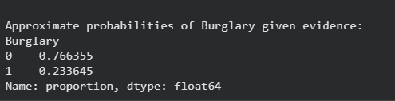
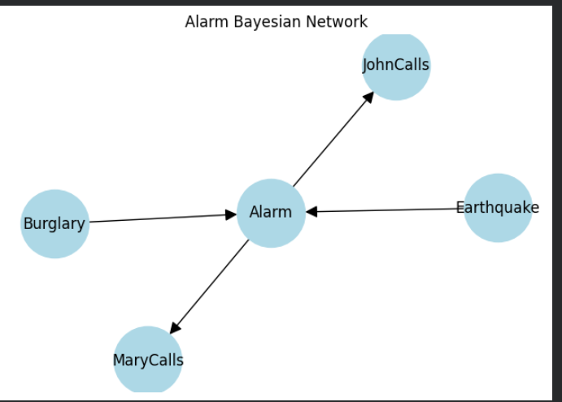

<H3>ENTER YOUR NAME : SANTHOSE AROCKIARAJ J</H3>
<H3>ENTER YOUR REGISTER NO. : 212224230248 </H3>
<H3>EX. NO.3</H3>
<H3>DATE : 11/02/2026</H3>
<H1 ALIGN =CENTER> Implementation of Approximate Inference in Bayesian Networks
</H1>

## Aim: 
   To construct a python program to implement approximate inference using Gibbs Sampling.</br>
## Algorithm:
   Step 1: Bayesian Network Definition and CPDs:<br>
    <ul> <li>Define the Bayesian network structure using the BayesianNetwork class from pgmpy.models.</li>
    <li>Define Conditional Probability Distributions (CPDs) for each variable using the TabularCPD class.</li>
    <li>Add the CPDs to the network.</li></ul>
    Step 2: Printing Bayesian Network Structure:<br>
    <ul><li>Print the structure of the Bayesian network using the print(network) statement.</li></ul>
   Step 3: Graph Visualization:
    <ul><li>Import the necessary libraries (networkx and matplotlib).</li>
    <li>Create a directed graph using networkx.DiGraph().</li>
    <li>Define the nodes and edges of the graph.</li>
    <li>Add nodes and edges to the graph.</li>
    <li>Optionally, define positions for the nodes.</li>
    <li>Use nx.draw() to visualize the graph using matplotlib.</li></ul>
    Step 4: Gibbs Sampling and MCMC:<br>
    <ul><li>Initialize Gibbs Sampling for MCMC using the GibbsSampling class and provide the Bayesian network.</li>
    <li>Set the number of samples to be generated using num_samples.</li></ul>
    Step 5: Perform MCMC Sampling:<br>
    <ul><li>Use the sample() method of the GibbsSampling instance to perform MCMC sampling.</li>
    <li>Store the generated samples in the samples variable.</li></ul>
    Step 6: Approximate Probability Calculation:<br>
    <ul><li>Specify the variable for which you want to calculate the approximate probabilities (query_variable).</li>
    <li>Use .value_counts(normalize=True) on the samples of the query_variable to calculate approximate probabilities.</li></ul>
    Step 7:Print Approximate Probabilities:<br>
    <ul><li>Print the calculated approximate probabilities for the specified query_variable.</li></ul>


## Program:
Insert your code here
```python
from pgmpy.models import DiscreteBayesianNetwork
from pgmpy.factors.discrete import TabularCPD
from pgmpy.sampling import GibbsSampling
import networkx as nx
import matplotlib.pyplot as plt

# Define Bayesian Network structure
alarm_model = DiscreteBayesianNetwork([
    ("Burglary", "Alarm"),
    ("Earthquake", "Alarm"),
    ("Alarm", "JohnCalls"),
    ("Alarm", "MaryCalls")
])

# Define CPTs
cpd_b = TabularCPD("Burglary", 2, [[0.999], [0.001]])
cpd_e = TabularCPD("Earthquake", 2, [[0.998], [0.002]])

cpd_a = TabularCPD(
    "Alarm", 2,
    [[0.999, 0.71, 0.06, 0.05],
     [0.001, 0.29, 0.94, 0.95]],
    evidence=["Burglary", "Earthquake"],
    evidence_card=[2, 2]
)

cpd_j = TabularCPD(
    "JohnCalls", 2,
    [[0.95, 0.1],
     [0.05, 0.9]],
    evidence=["Alarm"],
    evidence_card=[2]
)

cpd_m = TabularCPD(
    "MaryCalls", 2,
    [[0.99, 0.3],
     [0.01, 0.7]],
    evidence=["Alarm"],
    evidence_card=[2]
)

# Add CPTs and check model
alarm_model.add_cpds(cpd_b, cpd_e, cpd_a, cpd_j, cpd_m)
alarm_model.check_model()

# -------- Approximate Inference using Gibbs Sampling --------
gibbs_sampler = GibbsSampling(alarm_model)

num_samples = 50000
samples = gibbs_sampler.sample(size=num_samples)

# Estimate probability of Burglary given evidence
evidence_samples = samples[
    (samples["JohnCalls"] == 1) & (samples["MaryCalls"] == 1)
]

prob_burglary = evidence_samples["Burglary"].mean()

print("Approximate Inference using Gibbs Sampling")
print("P(Burglary | JohnCalls=1, MaryCalls=1) ≈", prob_burglary)

# -------- Draw Bayesian Network diagram --------
G = nx.DiGraph(alarm_model.edges())
plt.figure(figsize=(6,4))
nx.draw(G, with_labels=True, node_size=3000, node_color="lightblue", arrowsize=20)
plt.title("Alarm Bayesian Network")
plt.show()

```


## Output:





## Result:
Thus, Gibb's Sampling( Approximate Inference method) is succuessfully implemented using python.